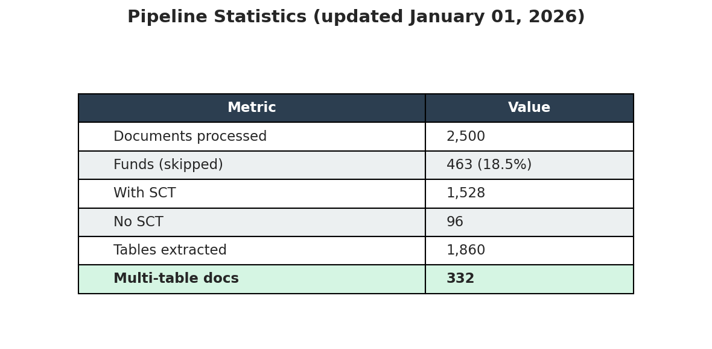
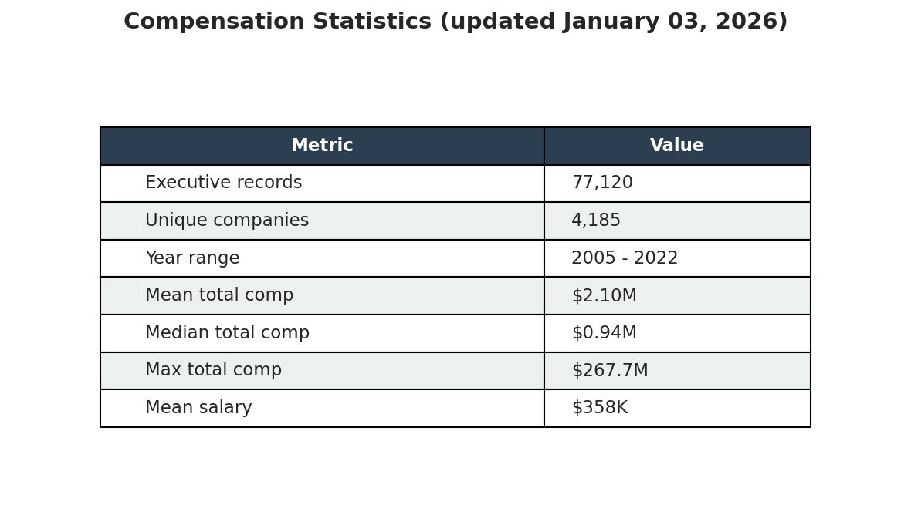
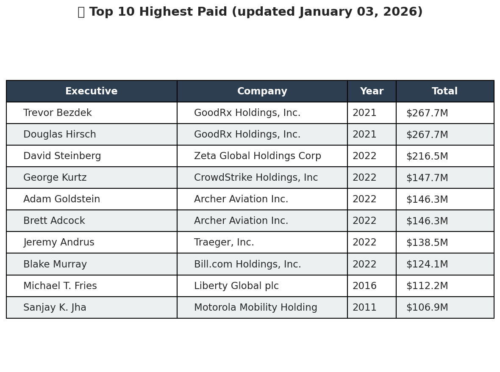
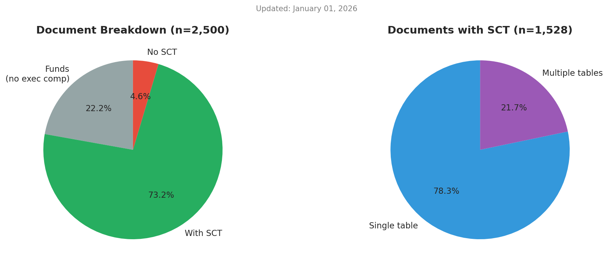
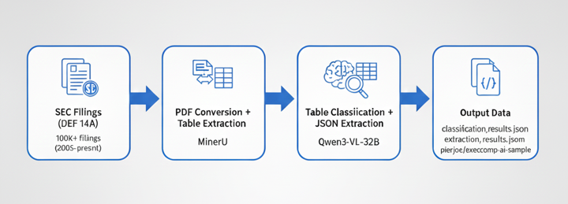
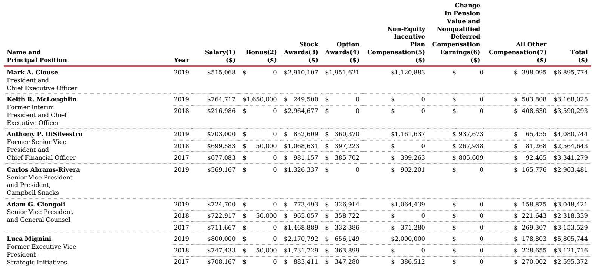

# Execcomp-AI

AI-powered pipeline to extract executive compensation data from SEC DEF 14A proxy statements.

<details>
<summary><b>📊 Current Progress & Statistics</b> (click to expand)</summary>

> 🚧 **Work in Progress** - Processing 100K+ SEC filings









👉 **Dataset**: [pierjoe/execcomp-ai-sample](https://huggingface.co/datasets/pierjoe/execcomp-ai-sample)

</details>

---

## Overview


Extracts **Summary Compensation Tables** from 100K+ SEC filings (2005-2022) using:
- **MinerU** for PDF table extraction (images + HTML)
- **Qwen3-VL-32B** for classification and structured extraction

```
SEC Filing → PDF → MinerU → Table Classification → JSON Extraction
```

---

## 📁 Project Structure

```
stuff/
├── scripts/
│   ├── pipeline.py      # Main extraction pipeline
│   └── to_hf.py         # HuggingFace upload script
├── src/
│   ├── vlm/             # VLM classification & extraction
│   ├── io/              # Results saving & loading
│   ├── mineru/          # PDF parsing with MinerU
│   └── download/        # SEC EDGAR downloader
├── notebooks/
│   └── pipeline.ipynb   # Interactive development
├── data/
│   └── DEF14A_all.jsonl # Filing metadata (local)
└── output/              # Processed results
```

---

## Quick Start

### 1. Start Servers

```bash
# GPU 0,1: Qwen3-VL for classification/extraction
CUDA_VISIBLE_DEVICES=0,1 vllm serve Qwen/Qwen3-VL-32B-Instruct \
    --tensor-parallel-size 2 --port 8000

# GPU 2,3: MinerU for PDF processing  
CUDA_VISIBLE_DEVICES=2,3 mineru-openai-server --engine vllm --port 30000 \
    --tensor-parallel-size 2
```

### 2. Run Pipeline

**Option A: Command line**
```bash
python scripts/pipeline.py
```

**Option B: Notebook**
Open `notebooks/pipeline.ipynb` and run cells in order.

### 3. Check Output

```
output/{cik}_{year}_{accession}/
├── extraction_results.json     # ✅ Main output
├── classification_results.json # Table classifications
├── metadata.json               # Document metadata
├── content_list.json           # MinerU parse results
├── images/                     # Extracted page images
└── tables/                     # Extracted table images
```

---

## ⚙️ Configuration

Edit variables at the top of `scripts/pipeline.py`:

```python
# Data source
HF_DATASET = "pierjoe/SEC-DEF14A-2005-2022"  # HuggingFace dataset
LOCAL_DATASET = "data/DEF14A_all.jsonl"       # Local file (priority)

# Processing limits
LIMIT = 10                        # Max documents to process (None = all)
YEARS = list(range(2005, 2023))   # Years to include

# Parallelization
DOC_MAX_CONCURRENT = 4            # Concurrent documents

# Reprocessing behavior
DONT_SKIP = False                 # Set True to force reprocess all
```

### Parallelization Levels

| Level | Config | Default | File |
|-------|--------|---------|------|
| Documents | `DOC_MAX_CONCURRENT` | 4 | `scripts/pipeline.py` |
| Classification | `CLASSIFY_MAX_CONCURRENT` | 8 | `src/vlm/classification.py` |
| Extraction | `EXTRACT_MAX_CONCURRENT` | 4 | `src/vlm/extraction.py` |

### Skip Logic

Documents are automatically skipped if:
- `extraction_results.json` exists → already processed with SCT
- `no_sct_found.json` exists → previously determined no SCT

Set `DONT_SKIP = True` to force reprocessing all documents.

---

## 📤 Upload to HuggingFace

After processing, upload results to HuggingFace:

```bash
# Build and push dataset
python scripts/to_hf.py --push
```

This will:
1. Scan all `output/*/extraction_results.json` files
2. Build a HuggingFace Dataset with all extracted data
3. Push to `pierjoe/execcomp-ai` repository

Without `--push`, it only shows statistics without uploading.

---

## Example

**Input:** [CAMPBELL SOUP DEF 14A 2019](https://www.sec.gov/Archives/edgar/data/16732/0001206774-19-003416-index.html)

**Extracted Table:**



**Output JSON:**
```json
{
    "name": "Luca Mignini",
    "title": "Former Executive Vice President - Strategic Initiatives",
    "fiscal_year": 2018,
    "salary": 747433,
    "bonus": 50000,
    "stock_awards": 1731729,
    "option_awards": 363899,
    "non_equity_incentive": 0,
    "change_in_pension": 0,
    "other_compensation": 228655,
    "total": 3121716
}
```

---

## Key Features

| Challenge | Solution |
|-----------|----------|
| Tables split across pages | Merge based on `is_header_only` flag + bbox proximity |
| Pre-2006 vs Post-2006 formats | Column mapping with synonyms |
| Funds (no exec comp) | Auto-skip when SIC = NULL |
| Resume after interruption | Skip docs with existing results |
| Slow processing | 3-level parallelization |

---

## Requirements

- Python 3.10+
- GPU with 40GB+ VRAM (or adjust tensor parallelism)

```bash
pip install -r requirements.txt
sudo apt-get install wkhtmltopdf
```

Key dependencies: `vllm`, `openai`, `aiohttp`, `datasets`, `huggingface_hub`

---

## OpenAI Compatible

The pipeline uses **OpenAI-compatible APIs** for classification and extraction. You can swap local models with cloud APIs:

```python
# Local (vLLM)
client = AsyncOpenAI(base_url="http://localhost:8000/v1", api_key="dummy")

# OpenAI / Azure / Anthropic / any OpenAI-compatible endpoint
client = AsyncOpenAI(api_key="sk-...")
MODEL = "gpt-4o"  # or any vision model
```

Only **MinerU** requires local GPU for PDF table extraction. Everything else works with cloud APIs.
