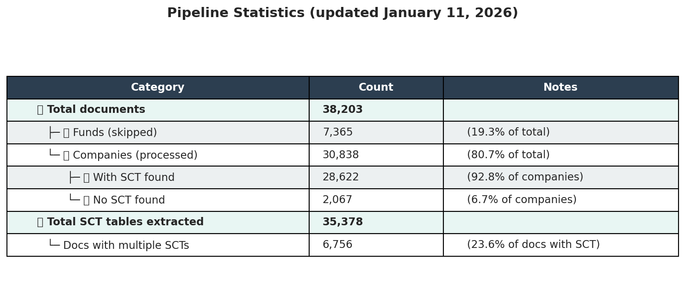
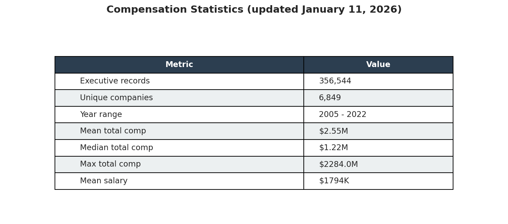
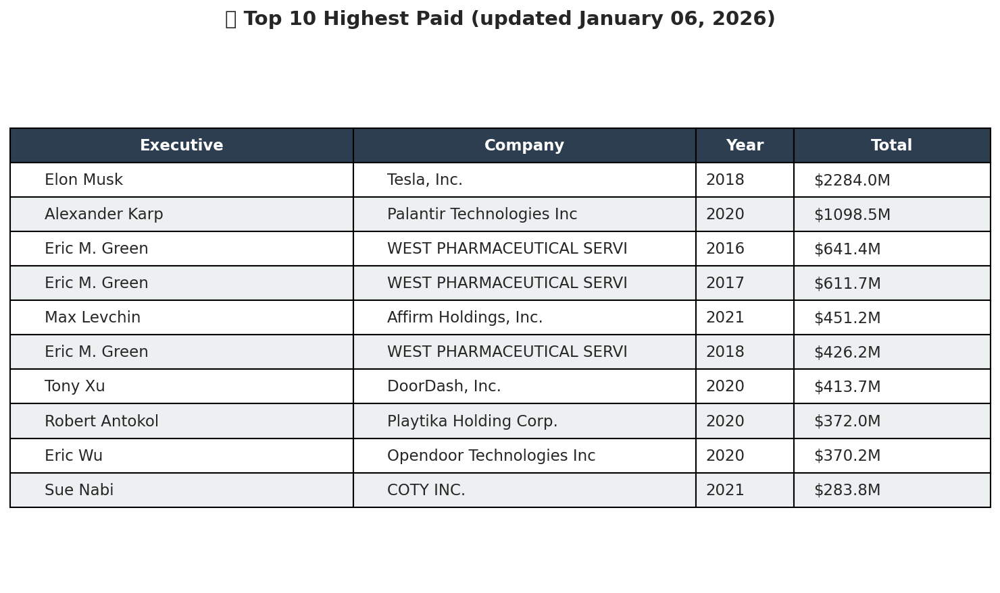
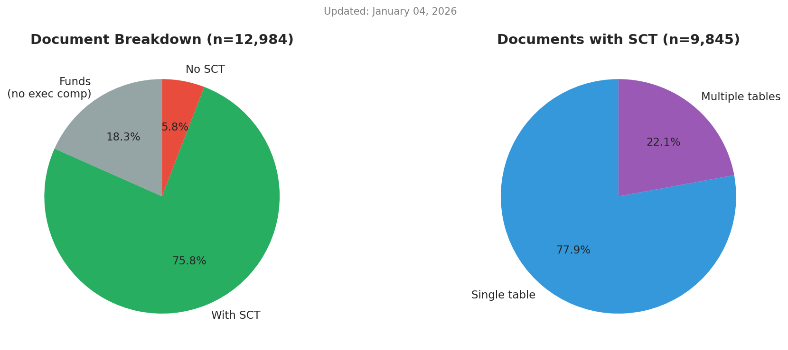
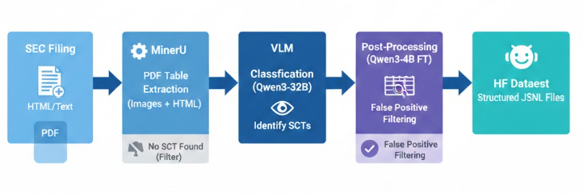
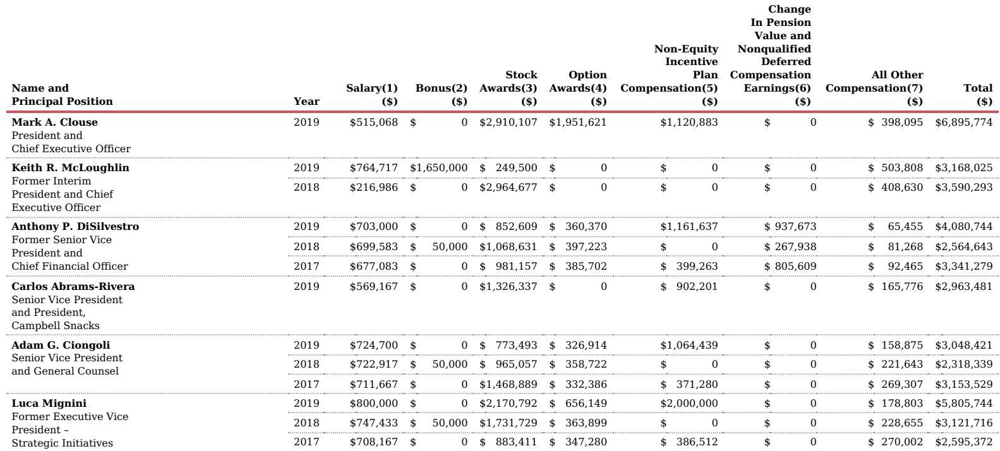

# Execcomp-AI

AI-powered pipeline to extract executive compensation data from SEC DEF 14A proxy statements.

<details>
<summary><b>📊 Current Progress & Statistics</b> (click to expand)</summary>

> 🚧 **Work in Progress** - Processing 100K+ SEC filings






👉 **Dataset**: [pierjoe/execcomp-ai-sample](https://huggingface.co/datasets/pierjoe/execcomp-ai-sample)

</details>

---

## Why This Project?

Executive compensation data from SEC filings is valuable for academic research, corporate governance analysis, and market studies. However, extracting this information at scale is surprisingly difficult:

| Challenge | Description |
|-----------|-------------|
| **Unstructured documents** | DEF 14A proxy statements are filed as HTML or plain text, with compensation tables embedded among hundreds of pages of legal text, footnotes, and varying formats |
| **Format changes over time** | SEC disclosure rules changed in 2006 — pre-2006 tables have different column names ("Securities Underlying Options" vs "Option Awards"), different structures, and often lack a Total column |
| **Tables break across pages** | A single Summary Compensation Table often spans multiple pages, and PDF parsers extract them as separate fragments that need to be intelligently merged |
| **Similar tables cause confusion** | Each proxy contains multiple compensation-related tables (director compensation, equity grants, pension benefits) that look similar to the Summary Compensation Table but contain different data |
| **No clean dataset exists** | Services like ExecuComp provide curated data but are expensive and limited in coverage. Raw SEC filings are free but require significant processing |

This project automates the entire extraction pipeline using vision-language models, producing structured JSON from raw filings with minimal manual intervention.

---

## Overview



Extracts **Summary Compensation Tables** from 100K+ SEC filings (2005-2022) using:
- **MinerU** for PDF table extraction (images + HTML)
- **Qwen3-VL-32B** for classification and structured extraction
- **Qwen3-VL-4B** (fine-tuned) for post-processing false positive filtering
```
SEC Filing → PDF → MinerU → VLM Classification → Extraction → Post-Processing → HF Dataset
                              (Qwen3-32B)         (Qwen3-32B)   (Qwen3-4B)
```

### Key Features

| Challenge | Solution |
|-----------|----------|
| Tables split across pages | Merge based on `is_header_only` flag + bbox proximity |
| Pre-2006 vs Post-2006 formats | Column mapping with synonyms |
| Funds (no exec comp) | Auto-skip when SIC = NULL |
| Resume after interruption | Central tracker + skip processed docs |
| Parallel processing | 3-level: MinerU, classification, extraction |
| Status tracking | `pipeline_tracker.json` as single source of truth |

---

## Quick Start

### 1. Installation
```bash
pip install -r requirements.txt
sudo apt-get install wkhtmltopdf
```

**Requirements:**
- Python 3.10+
- GPU with 40GB+ VRAM (or adjust tensor parallelism)
- Key dependencies: `vllm`, `openai`, `aiohttp`, `datasets`, `huggingface_hub`, `pdfkit`

### 2. Start Servers
```bash
# GPU 0,1: Qwen3-VL for classification/extraction
CUDA_VISIBLE_DEVICES=0,1 vllm serve Qwen/Qwen3-VL-32B-Instruct \
    --tensor-parallel-size 2 --port 8000 --max-model-len 32768

# GPU 2,3: MinerU for PDF processing  
CUDA_VISIBLE_DEVICES=2,3 mineru-openai-server \
    --engine vllm --port 30000 --tensor-parallel-size 2
```

### 3. Run Pipeline
```bash
# Show current status
python scripts/pipeline.py

# Process up to 1000 documents total
python scripts/pipeline.py 1000
```

To continue processing pending documents, edit `CONTINUE_MODE = True` in the script.

### 4. Post-Processing & Upload
```bash
# Build dataset with analysis, threshold analysis, and save locally
python scripts/post_processing.py

# Build and push to HuggingFace
python scripts/post_processing.py --push
```

Configuration in script:
- `RUN_ANALYSIS = True` - Generate stats images
- `RUN_THRESHOLD_ANALYSIS = True` - Analyze optimal threshold
- `SCT_PROBABILITY_THRESHOLD = None` - Filter threshold (None = keep all)

---

## Example

**Input:** [CAMPBELL SOUP DEF 14A 2019](https://www.sec.gov/Archives/edgar/data/16732/0001206774-19-003416-index.html)

**Extracted Table:**



**Output JSON:**
```json
[...
{
    "name": "Luca Mignini",
    "title": "Former Executive Vice President - Strategic Initiatives",
    "fiscal_year": 2018,
    "salary": 747433,
    "bonus": 50000,
    "stock_awards": 1731729,
    "option_awards": 363899,
    "non_equity_incentive": 0,
    "change_in_pension": 0,
    "other_compensation": 228655,
    "total": 3121716
}
...
]
```

---

## Project Structure
```
stuff/
├── scripts/
│   ├── pipeline.py          # Main extraction pipeline
│   ├── post_processing.py   # Build HF dataset with analysis
│   └── fix_pending.py       # Find and fix pending documents
├── src/
│   ├── vlm/                 # VLM classification & extraction
│   ├── processing/          # PDF conversion, MinerU, table extraction
│   ├── io/                  # Results saving & visualization
│   ├── tracking/            # Pipeline tracker (central status)
│   └── analysis/            # Stats, charts, threshold analysis
├── notebooks/
│   └── pipeline.ipynb       # Interactive development
├── data/
│   └── DEF14A_all.jsonl     # Filing metadata (local)
├── pipeline_tracker.json    # Central tracking file
├── output/                  # Processed results per document
└── pdfs/                    # Downloaded PDF files
```

### Output Structure
```
output/{cik}_{year}_{accession}/
├── metadata.json               # Document metadata
├── extraction_results.json     # ✅ Extracted compensation data
├── classification_results.json # Table classifications
├── no_sct_found.json          # (if no SCT found)
└── {doc_id}/
    ├── *_content_list.json    # MinerU parse results
    └── vlm/                    # Table images
```

---

## Scripts Reference

### `pipeline.py` - Main Pipeline
```bash
# Show status only
python scripts/pipeline.py

# Process N documents total (adds new if needed)
python scripts/pipeline.py 10000
```

To process pending documents, edit `CONTINUE_MODE = True` in the script.

The pipeline tracks all documents in `pipeline_tracker.json`:
- **Phases**: `pdf_created` → `mineru_done` → `classified` → `extracted`
- **Status**: `complete`, `no_sct`, `fund`, `pending`

### `post_processing.py` - Build Final Dataset

Builds the HuggingFace dataset with `sct_probability` scores from a fine-tuned binary classifier.
This is the **single script for dataset creation** - runs analysis, threshold optimization, and uploads.
```bash
# Build dataset locally (with full analysis output)
python scripts/post_processing.py

# Build and push to HuggingFace (includes README + images)
python scripts/post_processing.py --push
```

Configuration (edit in script):
- `CLASSIFIER_MODEL_PATH` - Path to fine-tuned classifier
- `CLASSIFIER_DEVICE` - GPU device (e.g., "cuda:0")
- `SCT_PROBABILITY_THRESHOLD` - Filter threshold (None = keep all)
- `RUN_ANALYSIS` - Generate pipeline stats and charts
- `RUN_THRESHOLD_ANALYSIS` - Find optimal threshold for single-SCT
- `HF_REPO` - HuggingFace repository name

Outputs:
- Stats images in `docs/` (pipeline, compensation, charts)
- Threshold analysis plot (`docs/analysis_threshold.png`)
- Recommended threshold printed to console
- Dataset saved locally and pushed to HF (with `--push`)

### `fix_pending.py` - Fix Failed Documents
```bash
# Show pending documents
python scripts/fix_pending.py

# Delete and reprocess pending
python scripts/fix_pending.py --fix
```

Categories:
- **No PDF**: HTML download failed
- **No MinerU**: MinerU processing failed  
- **Not classified**: Has tables but VLM classification failed

---

## Analysis Module

Stats and threshold analysis are in `src/analysis/` and called by `post_processing.py`.

Generated images in `docs/`:
- `stats_pipeline.png` - Pipeline statistics
- `stats_compensation.png` - Compensation statistics
- `stats_top10.png` - Top 10 highest paid executives
- `stats_breakdown.png` - Compensation breakdown by component
- `chart_pipeline.png` - Document breakdown pie charts
- `chart_by_year.png` - Tables by year
- `chart_distribution.png` - Compensation distribution
- `chart_trends.png` - Trends over time
- `analysis_threshold.png` - Threshold optimization plot

Output includes:
- `sct_probability`: Float 0-1, probability that table is a real SCT
- Statistics on how many duplicates the classifier can disambiguate

---

## Central Tracker

All pipeline status is stored in `pipeline_tracker.json`:
```json
{
  "last_updated": "2026-01-03T12:00:00",
  "documents": {
    "1002037_2016_0001437749-16-024320": {
      "cik": "1002037",
      "company_name": "ACME Corp",
      "year": 2016,
      "sic": "1234",
      "phases": {
        "pdf_created": "2026-01-01T10:00:00",
        "mineru_done": "2026-01-01T10:05:00",
        "classified": "2026-01-02T15:30:00",
        "extracted": "2026-01-02T15:31:00"
      },
      "status": "complete",
      "sct_tables": ["images/table_15.jpg"]
    }
  }
}
```

To rebuild tracker from files:
```python
from src.tracking import Tracker
tracker = Tracker()
tracker.rebuild_from_files()
```

---

## Configuration

Edit variables at the top of `scripts/pipeline.py`:
```python
SEED = 42424242                   # Random seed for reproducibility
VLM_BASE_URL = "http://localhost:8000/v1"
VLM_MODEL = "Qwen/Qwen3-VL-32B-Instruct"

MINERU_MAX_CONCURRENT = 8         # Concurrent MinerU processes
DOC_MAX_CONCURRENT = 16           # Concurrent document processing
```

---

## Check Status
```bash
python scripts/pipeline.py
```

Output:
```
==================================================
PIPELINE TRACKER STATUS
==================================================
Total documents: 8,015

By status:
  Complete (with SCT): 6,108
  No SCT found:        430
  Funds (skipped):     1,477
  Pending:             0

By phase completed:
  [1] PDF created:     8,015
  [2] MinerU done:     8,015
  [3] VLM processed:   6,538
      → Found SCT:     6,108
      → No SCT:        430
==================================================
```

---

## OpenAI Compatible

The pipeline uses **OpenAI-compatible APIs** for classification and extraction. You can swap local models with cloud APIs:
```python
# Local (vLLM)
client = AsyncOpenAI(base_url="http://localhost:8000/v1", api_key="dummy")

# OpenAI / Azure / Anthropic / any OpenAI-compatible endpoint
client = AsyncOpenAI(api_key="sk-...")
MODEL = "gpt-4o"  # or any vision model
```

Only **MinerU** requires local GPU for PDF table extraction. Everything else works with cloud APIs.
